# ClassLoader

- 类加载器子系统负责从文件系统或者网络中加载Class文件，class文件中文件开头有特定的文件标识。 既: 0xCAFEBABE(咖啡baby)
  ，这里有定义，[Constants](../../../../../../../src/java.base/share/classes/com/sun/java/util/jar/pack/Constants.java)

- ClassLoader只负责class文件的加载，至于它是否可以运行，则由Execution Engine决定

- 加载的类信息存放中一块称为方法区的内存空间。除了类的信息外，方法区中还会存放运行时常量池信息，可能还包括字符串字面量和数字常量等信息。

安装插件 `jclasslib Bytecode Viewer`

## 加载(Loading)

1. 通过一个类的全限定名获取定义此类的二进制流

2. 将这个字节流所代表的静态存储结构转换为方法区的运行时数据结构

3. 在内存中生成一个代表这个类的`java.lang.Class`对象，作为方法区这个类的各种数据的访问入口

加载`.class`文件的方式

- 从本地系统中直接加载

- 通过网络获取，典型的场景: Web Applet

- 从zip压缩包中读取，成为日后jar、war格式的基础

- 运行时计算生成: 动态代理技术、如ASM等

- 由其他文件生成，典型场景: JSP应用

- 从专有数据库中提取`.class`文件，比较少见

- 从加密文件中国读取，典型的防Class文件被反编译的保护措施

`BootStrap ClassLoader`是用C++编写的，用来加载Java核心类库。

JDK`1.8`中的`Ext ClassLoader`已经被`PlatformClassLoader`取代

`PlatformClassLoader`和`AppClassLoader`都被定义在`ClassLoaders`里面

- [ClassLoaders](../../../../../../../src/java.base/share/classes/jdk/internal/loader/ClassLoaders.java)

### 双亲委派机制

`BootStrap ClassLoader`负责加载`java`、`javax`、`sun`等包下的class

双亲委派机制就是当加载一个类的时候，并不由当前的ClassLoader进行加载，而是向上委托父类加载，直到`BootStrap ClassLoader`，
如果`BootStrap ClassLoader`都不加载，则由`App ClassLoader`加载，一层一层的委托。就像生活中有一个苹果🍎，尊老爱幼你询问你妈妈要吃苹果吗?
你妈妈询问你奶奶要吃苹果吗?如果你奶奶不吃则苹果到你妈妈手里🍏，如果你妈妈觉得这个苹果有点酸，则给你吃(亲儿子)。

### 类的主动加载和被动加载

主动加载有:

1. 创建类的实例

2. 访问某个类或接口的静态变量或者对该静态变量赋值

3. 调用类的静态方法

4. 反射(比如: Class.forName("java.lang.String"))

5. 初始化一个类的子类

6. Java虚拟机启动时被标明为启动类的类

7. JDK 7开始提供的动态语言支持

除了以上7种情况，其他使用Java类的方式都被看作是对**类的被动使用**，都**不会导致类的初始化**

## 🔗链接(Linking)

### 验证🔒(Verification)

- 目的在于确保Class文件的字节流中包含信息符合当前虚拟机要求，保证被加载类的正确性，不会危害虚拟机自身的安全

- 主要包括四种验证: 文件格式验证、元数据验证、字节码验证、符号引用验证

### 准备(Preparation)

- 为类变量分配内存并且设置该类变量的默认初始值，既0

- 这里不包含用final修饰的static，因为final中编译的时候就会分配了，准备阶段会显示初始化

- 这里不会为实例变量分配初始化，类变量会分配中方法区中，而实例变量是会随着对象一起分配到Java堆中

### 解析(Resolution)

- 将常量此内的符号引用转化为直接引用的过程

- 事实上，解析操作往往会伴随着JVM中执行完初始化之后再执行

- 符号引用就是一组符号来描述所引用的目标。

- 解析动作主要针对类或接口、字段、类方法、接口方法、方法类型等。 对应常量池中的`CONSTANT_Class_info`、`CONSTANT_Fieldref_info`、`CONSTANT_Methodref_info`等

## 初始化(Initialization)

- 初始化阶段就是执行类的构造器方法`<clinit>()`的过程

- 此方法不需要定义，是javac编译器自动收集类中的所有变量的赋值动作和静态代码块中的语句合并而来，
  参考[ClassInitTest](../../../../../test/java/cool/intent/java/lang/classloader/ClassInitTest.java)

- 构造器方法中的指令都按语句在源文件中出现的顺序执行。
  如[ClassInitTest_ASM.txt](../../../../../test/java/cool/intent/java/lang/classloader/ClassInitTest_ASM.txt)

- `<clinit>()`不同于类的构造器。(构造器是虚拟机视角下的`<init>()`)

- 若该类具有父类，JVM会保证子类的`<clinit>()`执行之前，父类的`<clinit>()`已经执行完毕，
  参考[ClassInitExtendsTest](../../../../../test/java/cool/intent/java/lang/classloader/ClassInitExtendsTest.java)

- 虚拟机必须保证一个类的`<clinit>()`方法在多线程被同步加锁，
  参考[ClassInitThreadTest](../../../../../test/java/cool/intent/java/lang/classloader/ClassInitThreadTest.java)