# GC 垃圾回收器

## System.gc()

[测试用例](../../../../../src/test/java/cool/intent/jvm/SystemGCTest.java)

[测试用例2](../../../../../src/test/java/cool/intent/jvm/LocalVarGC.java)

在默认情况下，`System.gc()`或者`Runtime.getRuntime().gc()`的调用，会显式的触发**Full GC**，同时对老年代和新生代进行回收，尝试释放被丢弃对象占用的内存。

然而`System.gc()`调用附带一个免责声明，无法保证对垃圾回收器的调用（调用时间不确定）。

JVM实现者可以通过`System.gc()`调用来决定JVM的GC行为。而一般情况下，垃圾回收应该是自动进行的，**无须手动触发，否则就太过于麻烦了**。在一些特殊情况下，如我们正在编写一个性能基准，我们可以在运行之间调用`System.gc()`。

## 内存溢出（OOM）

内存溢出相对于内存泄漏来说，尽管更容易被理解，但是同样的，内存溢出也是引发程序崩溃的罪魁祸首之一。

由于GC一直在发展，所有一般情况下，除非应用程序占用的内存增长速度非常快，造成垃圾回收已经跟不上内存消耗的速度，否则不太容易出现OOM的情况。

大多数情况下，GC会进行各种年龄段的垃圾回收，实在不行了就放大招，来一次独占式的Full GC操作，这时候会回收大量的内存，供应用程序继续使用。

javadoc中对OutOfMemoryError的解释是，**没有空闲内存，并且垃圾收集器也无法提供更多内存。**

首先说没有空闲内存的情况：说明Java虚拟机的堆内存不够。原因有二：
(1） Java虚拟机的堆内存设置不够
比如：可能存在内存泄漏问题，也很有可能就是堆的大小不合理，比如我们要处理比较可观的数据量，但是没有显式指定JVM堆大小或者指定数值偏小。我们可以通过参数-Xms、-Xmx来调整。
(2）代码中创建了大量大对象，并且长时间不能被垃圾收集器收集 （存在被引用）。对于老版本的Oracle JDK， 因为永久代的大小是有限的，并且JVM对永久代垃圾回收（如，常量池回收、卸载不再需要的类型）非常不积极，所以当我们不断添加新类型的时候，永久代出现OutOfMemoryError也非常多见，尤其是在运行时存在大量动态类型生成的场合；类似intern字符串缓存占用太多空间，也会导致OOM问题。对应的异常信息，会标记出来和永久代相关："java.lang. OutOfMemoryError: PermGen space"

随着元数据区的引入，方法区内存已经不再那么窘迫，所以相应的OOM有所改观，出现OOM，异常信息则变成了：“ java. lang .OutOfMemoryError: Metaspace"。直接内存不足，也会导致OOM。

这里面隐含着一层意思是，在抛出OutOfMemoryError之前，通常垃圾收集器会被触发，尽其所能去清理出空间。例如：在引用机制分析中，涉及到JVM会去尝试回收**软引用指向的对象等。**
在java.nio.BIts.reserveMemory()方法中，我们能清楚的看到，System.gc()会被调用，以清理空间。

当然，也不是在任何惜况下垃圾收集器都会被触发的
比如，我们去分配一个超大对象，类似一个超大数组超过堆的最大值，JVM可以判断出垃圾收集并不能解决这个问题，所以直接抛出OutOfMemoryError。

## 内存泄漏（Memory Leak）

也称作 “存储渗漏”。`严格来说`，**只有对象不会再被程序用到了，但是GC又不能回收他们的情况，才叫内存泄漏。**

但实际情况很多时候些不太好的实践（或疏忽）会导致对象的生命周期变得很长甚至导致OOM，也可以叫做**宽泛意义上的“内存泄漏”**

尽管内存泄漏并不会立刻引起程序崩溃，但是一旦发生内存泄漏，程序中的可用内存就会被逐步蚕食，直至耗尽所有内存，最终出现OutOfMemory异常，导致程序崩溃。

注意，这里的存储空间并不是指物理内存，而是指虚拟内存大小，这个虚拟内存大小取决于磁盘交换区设定的大小。

举例：

1. 单例模式
   单例的生命周期和应用程序是一样长的，所以单例程序中，如果特有对外部对象的引用的话，那么这个外部对象是不能被回收的，则会导致内存泄漏的产生。
2. 一些提供close的资源未关闭导致内存泄漏数据库连接 (dataSourse.geCconnection()），网络连接(Socket)和IO连接必须手动close，否则是不能被回收的。

## Stop The World

[测试用例](../../../../../src/test/java/cool/intent/jvm/StopTheWorldTest.java)

Stop-The-World，简称STW，指的是GC事件发生过程中，会产生应用程序的停顿。**停顿产生时整个应用程序线程都会被暂停，没有任何响应**，有点像卡死的感觉，这个停顿称为STW。 

可达性分析算法中枚举根节点（GC Roots）会导致所有Java执行线程停顿。

- 分析工作必须在一个能确保一致性的快照中进行
- 一致性指整个分析期间整个执行系统看起来像被冻结在某个时间点上
- **如果出现分析过程中对象引用关系还在不断变化，则分析结果的准确性无法保证**

被STW中断的应用程序线程会在完成GC之后恢复，频繁中断会让用户感觉像是网速不快造成电影卡带一样，所以我们需要减少STW的发生。

STW事件和采用哪款GC无关，所有的GC都有这个事件。

哪怕是G1也不能完全避免Stop-The-World 情况发生，只能说垃圾回收器越来越优秀，回收效率越来越高，尽可能地缩短了暂停时间。

STW是JVM在**后台自动发起和自动完成的**。在用户不可见的情况下，把用户正常的工作线程全部停掉。

开发中不要用`System.gc()`会导致Stop-The-World（Full GC）的发生。

## 并行和并发

二者对比：

- 并发，**指的是多个事情**，在同一时间段内同时发生了。
- 并行，**指的是多个事情**，在同一时间点上同时发生了。

并发的多个任务之间是互相抢占资源的

并行的多个任务之间是不互相抢占资源的。

只有在多CPU或者一个CPU多核的情况中，才会发生并行。否则，看似同时发生的事情，其实都是并发执行的。

### 并发（Concurrent）

在操作系统中，是指一个时间段中有几个程序都处于己启动运行到运行完毕之间，且这几个程序都是在同一个处理器上运行。

并发不是真正意义上的“同时进行”，只是CPU把一个时间段划分成几个时间片段(时间区间)，然后在这几个时间区间之间来回切换，由于CFU处理的速度非常快，只要时间间隔处理得当，即可让用户感觉是多个应用程序同时在进行。

### 并行（Parallel）

当系统有一个以上CPU时，当一个CPU执行一个进程时，另一个CPU可以执行另一个进程，两个进程互不抢占CPU资源，可以同时进行，我们称之为并行(Parallel) 

其实决定并行的因素不是CPU的数量，而是CPU的核心数量，比如一个CPU多个核也可以并行。

适合科学计算，后合处理等弱交互场景

## 垃圾回收的并行和并发

并发和并行，在谈论垃圾收集器的上下文语境中，它们可以解释如下：
- 并行 (Parallel）：指多条垃圾收集线程并行工作，但此时用户线程仍处于等待状态
如ParNew、 Parallel Scavenge、Parallel Old
- 串行 (Serial)
  相较于并行的概念，单线程执行
  如果内存不够，则程序暂停，启动JVM垃圾回收器进行垃圾回收。回收完，再启动程序的线程

并发和并行，在谈论垃圾收集器的上下文语境中，它们可以解释如下：

- 并发 (Concurrent）：指用户线程与垃圾收集线程同时执行（但不一定是并行的，可能会交替执行），垃圾回收线程在执行时不会停顿用户程序的运行。

  用户程序在继续运行，而垃圾收集程序线程运行于另一个CPU上。如：CMS、G1

## 标记阶段

### 引用计数算法

引用计数算法(Reference Counting)比较简单，对每个对象保存一个整型的引用计数器属性。用于记录对象被引用的情况。

对于一个对象A，只要有任何一个对象引用了A，则A的引用计数器就加1; 当引用失效时，引用计数器就减1。只要对象A的引用计数器的值为0，既表示对象A不可能再被使用，可进行回收。

优点: 实现简单、垃圾对象便于标识; **判定效率高**，回收没有延迟性

缺点:

- 需要单独的字段存储计数器，这样增加类**存储空间的开销**
- 每次赋值需要更新计数器，伴随着加法和减法的操作，这增加了**时间开销**
- 引用计数器有一个严重的bug，既无法处理**循环引用**的情况。所以导致了Java的垃圾回收器中没有使用到这类算法(Python使用了)。

### 可达性分析算法（Tracing Garbage Collection）

相对于引用计数算法而言，可达性分析算法不仅同样具备实现简单和执行高效等特点，更重要的是该算法可以有效地解决在引用计数算法中循环引用的问题，防止内存泄漏的发生。
相较于引用计数算法，这里的可达性分析就是Java、C#选择的。这种类型的垃圾收集通常也叫作追踪性垃圾收集 (Tracing Garbage Collection)

所谓的“GC Roots”根集合就是一组必须活跃的引用。

基本思路：

- 可达性分析算法是以根对象集合 (GC Roots) 为起始点，按照从上至下的方式搜索被根对象集合所连接的目标对象是否可达
- 使用可达性分析算法后，内存中的存活对象都会被根对象集合直接或间接连接着，搜索所走过的路径称为引用链 (Reference Chain)
- 如果目标对象没有任何引用链相连，则是不可达的，就意味着该对象己经死亡，可以标记为垃圾对象。
- 在可达性分析算法中，只有能够被根对象集合直接或者间接连接的对象才是存活对象。

GC Roots包括以下几种元素:

- 虚拟机栈中引用的对象。比如: 各个线程被调用的方法中使用到的参数、局部变量等
- 本地方法栈内JNI(通常说的本地方法)引用的对象。
- 方法区中类静态属性引用的对象。比如: 字符串常量池(String Table)里的引用
- 所有被同步锁synchroized持有的对象
- Java虚拟机内部的引用。比如: 基本数据类型对应的Class对象，一些常驻的异常对象(NullPointerException、OutOfMemoryError)，系统类加载器
- 反映Java虚拟机内部情况的JMXBean、JVMTI中注册的回调、本地嗲码缓存等。
- 除了这些固定的GC Roots集合以外，根据用户所选用的垃圾收集器以及当前回收的内存区域不同，还可以有其他对象"临时性"地加入，共同构成完整的GC Roots集合。比如: 分代收集和局部回收♻️(Partial GC)。
  - 如果只针对Java堆中的某一块区域进行垃圾回收(如: 只针对新生代)，必须考虑到内存区域锁虚拟机自己的实现细节，更不是孤立封闭的，这个区域的对象完全有可能被其他区域的对象所引用，这时候需要一并将关联的区域对象也加入GC Roots集合中去考虑，才能保证可达性分析的准确性。
- 小技巧: 由于GC Root采用栈方式存放变量和指针，所以如果一个指针，它保存了堆内存里面的对象，但是自己又不存放在堆内存里面，它就是一个Root。

注意:

- 如果要使用可达性分析算法来判断内存算法可以回收，那么分析工作必须在一个能保障一致性的快照中进行。这点不满足的话分析结果的准确性就无法保证。
- 这点也是导致GC进行时必须要**Stop The World**的一个重要原因。
  - 即使号称(几乎)不会发生停顿的CMS收集器中，枚举根节点时也是必须要停顿的。

## 对象的finalization机制

Java语言提供了对象终止(finalization)机制来允许开发人员提供对象被销毁之前的自定义处理逻辑。

当垃圾收集器发现没有引用指向一个对象，既: 垃圾回收此对象之前，总会先调用这个对象的`finaliz()`方法。

`finalize()`方法允许在子类中被重写，用于在对象被回收时进行资源释放。通常在这个方法中进行一些资源释放和清理工作，比如关闭文件、套接字和数据库连接🔗等。

永远不要主动的调用某个对象的`finalize()`方法，应该交给垃圾回收器机制调用。理由如下:

- 调用`finalize()`方法可能导致对象复活
- `finalize()`方法的执行时间时没有保障的，它完全由GC线程决定，极端情况下，若不发生GC，则`finalize()`方法将引用不会执行。
- 一个糟糕的`finalize()`会严重影响GC的性能。

如果从所有的根节点都无法访问某个对象，说明对象已经不再使用了，一般来说，此对象需要被回收。但事实上，也并非"非死不可"的，这时候它们暂时处于"缓刑"阶段。一个无法触及的对象有可能在某一个条件下"复活"自己，如果这样，那么它的回收就是不合理的，为此，定义虚拟机中的对象可能的3中状态。如下: 

- 可触及的: 从根节点开始，可以到达这个对象。
- 可复活的: 对象的所有引用都被释放，但对象有可能在`finalize()`中复活。
- 不可触及的: 对象的`finalize()`被调用，并且没有复活，那么就会进入不可触及状态。不可触及的对象不可能复活，因为`finalize()`只会被调用一次。

以上3中状态中，是由于`finalize()`方法的存在，进行的区分，只有在对象不可触及时才可以回收。

## 清除阶段

当成功区分出内存中存活对象和死亡对象后，GC 接下来的任务就是执行垃圾回收，释放掉无用对象所占用的内存空间，以便有足够的可用内存空间为新对象分配内存。

目前在JVM中比较常见的三种垃圾收集算法是标记一清除算法( Mark-Sweep)
复制算法（ Copying ）、标记 一 压缩算法( Mark-Compact )

三种算法比对：

|          | Mark-Sweep         | Makr-Compact     | Copying                               |
| -------- | ------------------ | ---------------- | ------------------------------------- |
| 速度     | 中等               | 最慢             | 最快                                  |
| 空间开销 | 少（但会堆积碎片） | 少（不堆积碎片） | 通常需要存活对象2倍空间（不堆积碎片） |
| 移动对象 | 否                 | 是               | 是                                    |

效率上来说，复制算法是当之无愧的老大，但是却浪费了太多内存。而为了尽量兼顾上面提到的三个指标，标记-整理算法相对来说更平滑一些，效率上不尽如人意，它比复制算法多了一个标记的阶段，比标记-清除多了整理内存的阶段。

### 标记-清除算法(Mark-Sweep)

标记-清除算法（ Mark-Sweep）是一种非常基础和常见的垃圾收集算法，该算法被J.McCarthy等人在1960年提出并并应用于Iisp语言。
执行过程：
当堆中的有效内存空间 (available memory）被耗尽的时候，就会停止整个程序（也被称为stop the world），然后进行两项工作，第一项则是标记，第二项则是清除。

标记：Collector 到用根节点开始遍历，标记所有被引用的对象。一般是在对象的Header中记录为可达对象。
清除：Co1lector对堆内存从头到尾进行线性的遍历，如果发现某个对象在其Header中没有标记为可达对象，则将其回收。

缺点：

- 效率不算高
- 在进行GC的时候，需要停止整个应用程序，导致用户体验差。
- 这种方式清理出来的空闲内存是不连续的，产生内存碎片。需要维护一个空闲列表。

### 复制算法(Copying)

背景：

为了解决标记-清除算法在垃圾收集效率方面的缺陷，M.L.Minsky于1963年发表了著名的论文，“使用双存储区的Iisp语言垃圾收集器CA LISP Garbage Collector Algorithm Using Serial Secondary Storage )”。M.L.Minsky 在该论文中描述的算法被人们称为复制 (Copying）算法，它也被M.L.Minsky 本人成功地引入到了Lisp语言的一个实现版本中。
核心思想：
将活着的内存空间分为两块，每次只使用其中一块，在垃圾回收时将正在使用的内存中的存活对象复制到未被使用的内存块中，之后清除正在使用的内存块中的所有对象，交换两个内存的角色，最后完成垃圾回收。

优点：

- 没有标记和清除过程，实现简单，运行高效。
- 复制过去以后保障空间的连续性，不会出现“碎片”问题。

缺点：

- 此算法的缺点也是很明显的，就是需要两倍的内存空间。
- 对于G1这种分拆标成为大量region的GC，复制而不是移动，意味着GC需要维护region之间对象引用关系，不管是内存占用或者时间开销也不小。

特别的：

- 如果系统中的垃圾对象很少，复制算法就不会很理想。复制算法需要复制的存活对象数量并不会太大，或者说非常低才行。

应用场景：

在新生代，对常规应用的垃圾回收，一般通常可以回收70%-99%的内存空间。回收性价比很高。所以现在的商业虚拟机都是这种收集算法回收新生代。

### 标记-压缩算法或标记-整理（Mark-Compact）

背景：
复制算法的高效性是建立在存活对象少、垃圾对象多的前提下的。这种情况在新生代经常发生，但是在老年代，更常见的情况是大部分对象都是存活对象。如果依然使用复制算法，由于存活对象较多，复制的成本也将很高。因此，基于老年代垃圾回收的特性，需要使用其他的算法。

标记-清除算法的确可以应用在老年代中，但是该算法不仅执行效率低下，而且在执行完内存回收后还会产生内存碎片，所以JVM 的设计者需要在此基础之上进行改进。标记压缩 (Mark Compact）算法由此诞生。

1970 年前后，G. L.Steele、 C.J.Chene 和D.S．Wise 等研究者发布标记压缩算法。在许多现代的垃圾收集器中，人们都使用了标记-压缩算法或其改进版本。

执行过程：

第一阶段和标记-清除算法一样，从根节点开始标记所有被引用的对象。

第二阶段将所有的存活对象压缩到内存的一端，按顺序存放。

之后，清理边界外所有的空间。

标记-压缩算法的最终效果等同于标记-清除算法执行完成后，再进行一次内存碎片整理，因此，也可以把它称为**标记-清除-压缩 (Mark-Sweep-Compact)算法**。

二者的本质差异在于标记-清除算法是一种**非移动式的回收算法**，标记-压缩是**移动式**的。是否移动回收后的存活对象是一项优缺点并存的风险决策。

可以看到，标记的存活对象将会被整理，按照内存地址依次排列，而未被标记的内存会被清理掉。如此一来，当我们需要给新对象分配内存时，JVM只需要持有一个内存的起始地址即可，这比维护一个空闲列表显然少了许多开销。

指针碰撞（Bump the Pointer）

如果内存空间以规整和有序的方式分布，即己用和未用的内存都各自一边，彼此之间维系着一个记录下一次分配起始点的标记指针，当为新对象分配内存时，只需要通过修改指针的偏移量将新对象分配在第一个空闲内存位置上，这种分配方式就叫做指针碰撞 (Bump the Pointer)。

优点：

- 消除了标记-清除算法当中，内存区域分散的缺点，我们需要给新对象分配内存时，JVM只需要持有一个内存的起始地址即可。

- 消除了复制算法当中，内存减半的高额代价。

缺点：

- 从效率上来说，标记-整理算法要低于复制算法。
- 移动对象的同时，如果对象被其他对象引用，则还需要调整引用的地址。
- 移动过程中，需要全程暂停用户应用程序。即：STW

## 分代收集算法 (Generational Collecting）

前面所有这些算法中，并没有一种算法可以完全替代其他算法，它们都具有自己独特的优势和特点。分代收集算法应运而生。

分代收集算法，是基于这样一个事实：不同的对象的生命周期是不一样的。因此，`不同生命周期的对象可以采取不同的收集方式，以便提高回收效率`。一般是把Java堆分为新生代和老年代，这样就可以根据各个年代的特点使用不同的回收算法，以提高垃圾回收的效率。

在Java程序运行的过程中，会产生大量的对象，其中有些对象是与业务信息相关，比如`Http请求中的Session对象、线程、Socket连接`，这类对象跟业务直接挂钩，因此生命周期比较长。但是还有一些对象，主要是程序运行过程中生成的临时变量，这些对象生命周期会比较短，比如：`String对象`，由于其不变类的特性，系统会产生大量的这些对象，有些对象甚至只用一次即可回收。

**目前几乎所有的GC都是采用分代收集 (Generational Collecting）算法执行垃圾回收的。**

在Hotspot中，基于分代的概念，GC所使用的内存回收算法必须结合年轻代和老年代各自的特点。

- 年轻代 (Young Gen) 
  年轻代特点：区城相对老年代较小，对象生命周期短、存活率低，回收频繁。这种情况复制算法的回收整理速度是最快的。复制算法的效率只和当前存活对象大小有关，因此很适用于年轻代的回收。而复制算法内存利用率不高的问题，通过hotspot中的两个surVivor的设计得到缓解。
- 老年代 (Tenured Gen)
  老年代特点：区城较大，对象生命周期长、存活率高，回收不及年轻代频察。这种情况存在大量存活率高的对象，复制算法明显交得不合适。一般是由标记-清除或者是标记-消除与标记-整理的混合实现。
  - Mark阶段的开销与存活对象的数量成正比。
  - Sweep阶段的开销与所管理区城的大小成正相关。
  - Compact阶段的开销与存活对象的数据成正比。

以HotSpot中的CMS回收器为例，CMS是基于Mark-Sweep实现的，对于对象的回收效率很高。而对于碎片问题，CMS采用基于Mark-Compact算法的Serial Old回收器作为补偿措施：当内存回收不佳（碎片导致的Concurrent Mode Failure时），将采用Serial Old执行Full GC以达到对老年代内存的整理。

分代的思想被现有的虚拟机广泛使用。几乎所有的垃圾回收器都区分新生代和老年代。

## 增量收集算法(Incremental Collecting）

上述现有的算法，在垃圾回收过程中，应用软件将处于一种Stop the World的状态。在Stop the World 状态下，应用程序所有的线程都会挂起，暂停一切正常的工作，等待垃圾回收的完成。如果垃圾回收时间过长，应用程序会被挂起很久，将严重影响用户体验或者系统的稳定性。为了解决这个问题，即对实时垃圾收集算法的研究直接导致了增量收集 (Incremental Collecting）算法的诞生。

基本思想
如果一次性将所有的垃圾进行处理，需要造成系统长时间的停顿，那么就可以让垃圾收集线程和应用程序线程交替执行。每次，垃圾收集线程只收集一小片区域的内存空间，接着切换到应用程序线程。依次反复，直到垃圾收集充成。

总的来说，增量收集算法的基础仍是传统的标记-清除和复制算法。增量收集算法通过对线程间冲突的妥善处理，允许垃圾收集线程以分阶段的方式完成标记、
清理或复制工作。

缺点：

使用这种方式，由于在垃圾回收过程中，间断性地还执行了应用程序代码，所以能减少系统的停顿时间。但是，因为线程切换和止下文转换的消耗，会使得垃圾回收的总体成本上升，`造成系统吞吐量的下降`。

## 分区算法

一般来说，在相同条件下，堆空间越大，一次GC时 所需要的时间就越长，有关GC产生的停顿也越长。为了更好地控制GC产生的停顺时间，将一块大的内存区域分割成多个小块，根据目标的停顿时间，每次合理地回收若干个小区间，而不是整个堆空间，从而减少一次GC所产生的停顿。

分代算法将按照对象的生命周期长短划分成两个部分，分区算法将整个堆空间划分成连续的不同小区间（region）。

每一个小区间都独立使用，独立回收。这种算法的好处是可以控制一次回收多少个小区间。

