# GC

## 对比

- 新生代GC：Serial 、ParNew、Parallel Scavenge
- 老年代GC：Serial Old、Parallel Old、CMS
- 通用GC：G1

## 组合关系

## Serial GC：串行回收

> 适合单CPU

- [测试用例](../../../../../src/test/java/cool/intent/jvm/gc/SerialGCTest.java)

Serial收集器是最基本、历史最悠久的垃圾收集器了。JDK1.3之前回收新生代唯一的选择。

Serial收集器作为HotSpot中Client模式下的默认新生代垃圾收集器。

Serial 收集器采用**复制算法、串行回收和”Stop-The-World”机制**的方式执行内存回收。

除了年轻代之外，Serial收集器还提供用于执行老年代垃圾收集的Serial Old收集器。

Serial Old 收集器同样也采用了**串行回收和"Stop The World”机制，只不过内存回收算法使用的是标记-压缩算法**

Serial Old是运行在Client模式下默认的老年代的垃圾回收器

Serial Old在Server模式下主要有两个用途：
① 与新生代的Parallel Scavenge配合使用 
② 作为老年代CMS收集器的后备垃圾收集方案

这个收集器是一个单线程的收集器，但它的“单线程”的意义并不仅仅说明它**只会使用一个 CPU 或一条收集线程去完成垃圾收集工作**，更重要的是在它进行垃圾收集时，**必须暂停其他所有的工作线程**，直到它收集结束 (Stop The World)。

优势：

简单而高效（与其他收集器的单线程比），对于限定单个 CPU 的环境来说，Serial收集器由于没有线程交互的开销，专心做垃圾收集自然可以获得最高的单线程收集效率。

- 运行在Client模式下的虚拟机是个不错的选择。

在用户的桌面应用场景中，可用内存一般不大（几十MB至一两百MB）可以在较短时问内完成垃圾收集（几十ms至一百多ms），只要不频繁发生，使用串行回收器是可以接受的。

### 参数

在Hotspot虚拟机中，使用`-XX:UseSerialGC`参数可以指定年轻代和老年代都使用串行收集器。

- 等价于 新生代用Serial GC，且老年代用Serial Old GC

## ParNew GC：并行回收

> 因JDK 14 CMS被删除，所以此年轻代GC在JDK 14 已经无法使用

- [测试用例](../../../../../src/test/java/cool/intent/jvm/gc/ParNewGCTest.java)

如果说Serial Gc是年轻代中的单线程垃圾收集器，那么ParNew收集器则是Serial收集器的多线程版本。

- Par是Parallel的缩写，New：只能处理的是新生代

ParNew 收集器除了采用并行回收的方式执行内存回收外，两款垃圾收集器之间几乎没有任何区别。ParNew收集器在年轻代中同样也是采用**复制算法、"Stop-The-World"机制。**

ParNew 是很多JVM运行在Server模式下新生代的默认垃圾收集器。

- 对于新生代，回收次数频繁，使用并行方式高效。
- 对于老年代，回收次数少，使用串行方式节省资源。（CPU并行需要切换线程，串行可以节省切换线程的资源）

由于ParNew收集器是基于并行回收，那么是否可以断定ParNew收集器的回收效率在任何场景下都会比Serial收集器更高效？

ParNew 收集器运行在多CPU的环境下，由于可以充分利用多CPU、多核心等物理硬件资源优势，可以更快速地完成垃圾收集，提升程序的吞吐量。

但是在单个CPU的环境下，ParNew收集器不比Serial收集器更高效。虽然serial收集器是基于串行回收，但是由于CPU不需要频繁地做任务切换，因此可以有效避免多线程交互过程中产生的一些额外开销。

因为除Serial外，目前只有ParNew GC能与CMS GC组合工作。

### 参数

在程序中，开发人员可以通过选项`-XX:+UseParNewGC`手动指定使用ParNew收集器执行内存回收任务。它表示年轻代使用并行收集器，不影响老年代。

`-XX:ParallelGCThreads` 限制线程数量，默认开启和CPU数据相同的线程数。

## Parallel Scavenge GC：吞吐量优先

> 在JDK 8中，默认是此垃圾收集器。

Hotspot的年轻代中除了拥有ParNew收集器是基于并行回收的以外，Parallel Scavenge收集器同样也采用了**复制算法、并行回收和”Stop The World"机制。**

那么Parallel收集器的出现是否多此一举？

- 和ParNew收集器不同，Parallel Scavenge收集器的目标则是达到一个**可控制的吞吐量 (Throughput）**，它也被称为吞吐量优先的垃圾收集器。
- 自适应调节策略也是Parallel Scavenge与ParNew一个重要区别。

高吞吐量则可以高效率地利用 CPU 时间，尽快完成程序的运算任务，主要**适合在后台运算而不需要太多交互的任务**。因此，常见在服务器环境中使用。例如，那些执行**批量处理、订单处理、工资支付、科学计算的应用程序。**

Parallel 收集器在JDK 1.6时提供了用于执行老年代垃圾收集的Parallel 0ld收集器，jin s用来代替老年代的Serial Old收集器。

Parallel Old收集器采用了**标记-压缩算法**，但同样也是基于**并行回收和"Stop-The-World"机制。**

在程序吞吐量优先的应用场景中，Parallel收集器和Parallel Old收集器的组合，在Server模式下的内存回收性能很不错。**在JDK 8中，默认是此垃圾收集器。**

### 参数

`-XX:+UseParallelGC`手动指定年轻代使用Parallel并行收集器执行内存回收任务。
`-XX:+UseParallelOldGC`手动指定老年代都是使用并行回收收集器。

分别适用于新生代和老年代。JDK 8是默认开启的。
上面两个参数，默认开启一个，另一个也会被开启。（互相激活）

`-XX:ParallelGCThreads`设置年轻代并行收集器的线程数。一般地最好**与CPU数量相等**，以避免过多的线程数影响垃圾收集性能。
在默认情况下，当CPU 数量小于8个，ParallelGCThreads 的值等于CPU 数量。

当CPU数量大于8个，ParallelGCThreads 的值等于**3 + [5 * CPU Count] / 8**

`-XX:MaxGCPauseMillis`设置垃圾收集器最大停顿时间（即STW的时间)。单位是毫秒。

- 为了尽可能地把停顿时间控制在MaxGCPauseMillis以内，收集器在工作时会调整Java堆大小或者其他一些参数。
- 对于用户来讲停顿时间越短体验越好。但是在服务器端，我们注重高并发，整体的吞吐量。所以服务器端适合Parallel，进行控制。该参数使用需谨慎

`-XX:GCTimeRatio`。 垃圾收集时间占总时间的比例（= **1 / (N +1)**)。用子衡量吞吐量的大小。

- 取值范围（0,100）。默认值99，也就是垃圾回收时间不超过1%。
- 与前一个`-XX:MaxGCPauseMillis`参数有一定矛盾性。暂停时问越长，Radio参数就容易超过设定的比例。

`-XX:UseAdaptiveSizePolicy`设置Parallel Scavenge收集器具有自适应调节策略

- 在这种模式下，年轻代的大小、Eden和Survivor的比例、晋升老年代的对象年龄等参数会被自动调整，己达到在堆大小、吞吐量和停顿时间之间的平衡点。
- 在手动调优比较困难的场合，可以直接使用这种自适应的方式，仅指定虚拟机的最大堆、目标的吞吐量 (GCTimeRatio）和停顿时间(MaxGCPauseMills)，让虚拟机自己完成调优工作。

## CMS GC：低延时

> JDK 14中已经删除了CMS GC

[测试用例](../../../../../src/test/java/cool/intent/jvm/gc/CMSGCTest.java)

在JDK 1.5 时期，Hotspot 推出了一款在强交互应用中几乎可认为有划时代意义的垃圾收集器：CMS (Concurrent-Mark-Sweep）收集器，这款收集器是Hotspot虚拟机中第一款真正意义上的并发收集器，它第一次实现了让坑圾收集线程与用户线程同时工作。

CMS收集器的关注点是尽可能缩短垃圾收集时用户线程的停顿时间。停顿时间越短（低延迟）就越适合与用户交互的程序，良好的响应速度能提升用户体验

目前很大一部分的Java应用集中在互联网站或者B/S系统的服务端上，这类应用尤其重视服务的响应速度，希望系统停顿时间最短，以给用户带来较好的体验。CMS收集器就非常符合这类应用的需求。

CMS的垃圾收集算法采用**标记-清除算法**，并且也会”Stop-The-World” 

不幸的是，CMS 作为老年代的收集器，却无法与 JDK 1.4.0 中己经存在的新生代收集器Parallel Scavenge 配合工作，所以在JDK 1.5中使用CMS来收集老年代的时候，新生代只能选择ParNew或者Serial收集器中的一个。

在G1出现之前，CMS使用还是非常广泛的。一直到今天，仍然有很多系统使CMS GC。

CMS整个过程比之前的收集器要复杂，整个过程分为4个主要阶段，即初始标记阶段、并发标记阶段、重新标记阶段和并发清除阶段。 

- 初始标记（Initial-Mark）阶段：在这个阶段中，程序中所有的工作线程都将会因为“Stop-The-World”机制而出现短暂的暂停，这个阶段的主要任务**仅仅只是标记出GC Roots能直接关联到的对象。**一旦标记完成之后就会恢复之前被皙停的所有应用线程。由于直接关联对象比较小，所以这里的速度非常快。

- 并发标记（Concurrent-Mark）阶段：从GC Roots的**直接关联对象开始遍历整个对象图的过程**，这个过程**耗时较长**但是**不需要停顿用户线程**，可以与垃圾收集线程一起并发运行。

- 重新标记（Remark）阶段：由于在并发标记阶段中，程序的工作线程会和垃圾收集线程同时运行或者交叉运行，因此为了**修正并发标记期间，因用户程序继续运作而导致标记产生变动的那一部分对象的标记记录**，这个阶段的停顿时间通常会比初始标记阶段稍长一些，但也远比并发标记阶段的时间短。
-  并发清除（Concurrent-Sweep）阶段：此阶段**清理删除掉标记阶段判断的己经死亡的对象，释放内存空间**。由于不需要移动存活对象，所以这个阶段也是可以与用户线程同时并发的

尽管CMS收集器采用的是并发回收（非独占式），但是在**其初始化标记和再次标记这两个阶段中仍然需要执行 “Stop-The-World” 机制**暂停程序中的工作线程，不过暂停时间并不会太长，因此可以说明目前所有的垃圾收集器都做不到完全不需要"Stop-The-World”，只是尽可能地缩短暂停时间。

**由于最耗费时间的并发标记与并发清除阶段都不需要暂停工作，所以整体的回收是低停顿的。**

另外，由于在垃圾收集阶段用户线程没有中断，所以在**CMS回收过程中，还应该确保应用程序用户线程有足够的内存可用**。因此，CMS收集器不能像其他收集器那样等到老年代几乎完全被填满了再进行收集，而是当**堆内存使用率达到某一阈值时，便开始进行回收**以确保应用程序在CMS工作过程中依然有足够的空间支持应用程序运行。要是CMS运行期间预留的内存无法满足程序需要，就会出现一次**Concurrent Mode Failure**失败，这时虚拟机将启动后备预案：临时启用 Serial Old 收集器来重新进行老年代的垃圾收集，这样停顿时间就很长了。

CMS收集器的垃圾收集算法采用的是**标记-清除算法**，这意味者每次执行完内存回收后，由于被执行内存回收的无用对象所占用的内存空间极有可能是不连续的一些内存块，不可避免地将**会产生一些内存碎片**。那么CMS在为新对象分配内存空间时，将无法使用指针碰撞 (Bump the Pointer）技术，而只能够选择空闲列表(Free List）执行内存分配。

> 有人会觉得既然Mark Sweep会造成内存碎片，那么为什么不把算法换成Mark compact 呢？

答案其实很简答，因为当并发清除的时候，用Compact整理内存的话，原来的用户线程使用的内存还怎么用呢？要保证用户线程能继续执行，前提的它运行的资源不受影响嘛。Mark Compact更适合“Stop The World'这种场景下使用。

### 优点

- 并发收集
- 低延时

### 缺点

- **会产生内存碎片**，导致并发清除后，用户线程可用的空间不足。在无法分配大对象的情况下，不得不提前触发Full GC。
- **CMS收集器对CPU资源非常敏感**。在并发阶段，它虽然不会导致用户停顿，但是会因为占用了一部分线程而导致座用程序变慢，总吞吐量会降低。
- **CMS收集器无法处理浮动垃圾**。可能出现 “Concurrent Mode Failure”失败而导致另一次 Fu11 Gc 的产生。在并发标记阶段由于程序的工作线程和垃圾收集线程是同时运行或者交叉运行的，那么在**并发标记阶段如果产生新的垃圾对象，CMS将无法对这些垃圾对象进行标记，最终会导致这些新产生的垃圾对象没有被及时回收**，从而只能在下一次执行Gc时释放这些之前未被回收的内存空间。

### 参数

`-XX:+UseConcMarkSweepGC`手动指定使用CMS 收集器执行内存回收任务。

- 开启该参数后会自动将`-XX:+UseParNewGC`打开。即：ParNew (Young区域) + CMS (0ld区域) + Serial Old的组合。

`-XX:CMSInitiatingOccupanyFraction` 设置堆内存使用率的阈值旦达到该阈值，便开始进行回收。

- JDK 5及以前版本的默认值为68%，即当老年代的空间使用率达到68%时，会执行一次CMS 回收。JDK 6及以上版本默认值为92%。
- 如果内存增长缓慢，则可以设置一个稍大的值，大的阈值可以有效降低CMS的触发频率，减少老年代回收的次数可以较为明是地改善应用程序性能。反之，如果应用程序内存使用率增长很快，则应该降低这个阈值，以避免频繁触发老年代串行收集器。因此**通过该选项便可以有效降低Full GC 的执行次数。**

`-XX:+UseCMSCompactAtFullCollection` 用于指定在执行完Full CC后对内存空间进行压缩整理，以此避免内存碎片的产生。不过由于内存压缩整理过程无法并发执行，所带来的问题就是停顿时间变得更长了。
`-XX:CMSFullGCsBeforeCompaction` 设置在执行多少次Full GC后对内存空间进行压缩整理。
`-XX:ParallelCMSThreads`设置CMS的线程数量

- CMS 默认启动的线程数是 **(ParallelGCThreads + 3) / 4**，ParallelGcThreads 是年轻代并行收集器的线程数。当CPU 资源比较紧张时，受到CMS收集器线程的影响，应用程序的性能在垃圾回收阶段可能会非常糟糕。

### 小结
HotSpot有这么多的垃圾回收器，那么如果有人问，Serial GC、Parallel GC、 Concurrent Mark Sweep GC这三个GC有什么不同呢？
请记住以下口令：
如果你想要最小化地使用内存和并行开销，请选Serial GC。
如果你想要最大化应用程序的吞吐量，请选Parallel GC。
如果你想要最小化GC的中断或停顿时间，请选CMS GC。

### 变化

JDK9新特性：CMS被标记为Deprecate了 (JEP291)

- 如果对JDK 9及以上版本的Hotspot虚拟机使用参数`-XX:+UseConcMarkSweepGC`来开启CMS收集器的话，用户会收到一个警告信息，提示CMS未来将会被废弃。

- JDK14新特性：删除CMS垃圾回收器(JEP363）

  - 移除了CMS垃圾收集器，如果在JDK14中使用`-XX:+UseConcMarkSweepGC`的话，JVM不会报错，只是给出一个warning信息，但是不会exit。JVM会自动回退以默认GC方式启动JVM

>  OpenJDK 64-Bit Server VM warning: Ignoring option UseConcMarkSweepGC;
>
> © support was removed in 14.0
> and the VM will continue execution using the default collector.

## G1 GC：区域分代化

> JDK 7 Update 4引入 G1
>
> JDK 9默认的GC

### 问提

>  既然我们已经有了前面几个强大的GC，为什么还要发布Garbage First (G1) GC?

原因就在于应用程序所应对的**业务越来越庞大、复杂，用户越来越多**，没有GC就不能保证应用程序正常进行，而经常造成STW的GC又跟不上实际的需求，所以才会不断地尝试对GC进行优化。G1 (Garbage-First）垃圾回收器是在Java 7 update 4之后引入的一个新的垃圾回收器，是当今收集器技术发展的最前沿成果之一。

与此同时，为了适应现在**不断扩大的内存和不断增加的处理器数量**， 进一步降低暂停时间 (pause time），同时兼顾良好的吞吐量。

**官方给G1设定的目标是在延迟可控的情况下获得尽可能高的吞吐量，所以才担当起“全功能收集器” 的重任与期望。**

> 为什么名字叫做Garbage First (G1）呢？

因为G1是一个并行回收器，它把堆内存分副为很多不相关的区域(Region)（物理上不连续的）。使用不同的Region来表示Eden、幸存者0区，幸存者1区，老年代等。

G1 GC有计划地避免在整个Java 堆中进行全区域的垃圾收集。G1 跟踪各个 Region里面的垃圾堆积的价值大小（回收所获得的空间大小以及回收所需时间的经验值），在后台维护一个优先列表，**每次根据允许的收集时间，优先回收价值最大的Region。**

由于这种方式的侧重点在于回收垃圾最大量的区间 (Region），所以我们给G1一个名字：垃圾优先 (Garbage First)。

### 概述

G1 (Garbage-First）是一款面向服务端应用的垃圾收集器，**主要针对配备多核CPU及大容量内存的机器**，以极高概率满足GC停顿时间的同时，还兼
具高吞吐量的性能特征。

在JDK1 .7版本正式启用，移除了Experimental的标识，**是JDK 9以后的默 认垃圾回收器**，取代了CMS 回收器以及Parallel + Parallel Old组合。被Oracle官方称为 “全功能的垃圾收集器”

与此同时，CMS己经在JDK 9中被标记为废弃 (deprecatea）。在JDK 8中还不是默认的垃圾回收器，需要使用`-XX:+UseG1GC`来启用。

### 优势 / 特点

与其他 GC 收集器相比，G1使用了全新的分区算法，其特点如下所示：

- 并行与并发

  - 并行性：G1在回收期间，可以有多个GC线程同时工作，有效利用多核计算能力。此时用户线程STW
  - 并发性：G1拥有与应用程序交替执行的能力，部分工作可以和应用程序同时执行，因此，一般来说，不会在整个回收阶段发生完全阻塞应用程序的情况

- 分代收集
- 从分代上看，**G1依然属于分代型垃圾回收器**，它会区分年轻代和老年代，年轻代依然有Eden区和Survivor区。但从堆的结构上看，它不要求整个Eden区、年轻代 或者老年代都是连续的，也不再坚持固定大小和固定数量。
  -   将**堆空间分为若干个区域(Region），这些区域中包含了逻辑上的年轻代和老年代**
  - 和之前的各类回收器不同，它同时**兼顾年轻代和老年代**。对比其他回收器，或者工作在年轻代，或者工作在老年代。

- 空间整合
  - CMS：“标记-清除”算法、内存碎片、若干次GC后进行一次碎片整理
  - G1将内存划分为一个个的region。内存的回收是以region作为基本单位的。**Region之间是复制算法**，但整体上实际可看作是**标记-压缩 （Mark-Compact）算法**，两种算法都可以避免内存碎片。这种特性有利于程序长时间运行，分配大对象时不会因为无法找到连续内存空间而提前触发下一次 GC。尤其是当Java堆非常大的时候，G1的优势更加明显。

- 可预测的停顿时间模型（既：软实时 soft real-time）

  这是 G1相对于CMS 的另一大优势，G1除了追求低停顿外，还能建立可预测的停顿时间模型，能让使用者明确指定在一个长度为 M 毫秒的时间片段内，消耗在垃圾收集上的时间不得超过 N 毫秒。

  - 由于分区的原因，G1可以只选取部分区域进行内存回收，这样缩小了回收的范围，因此对于全局停顿情况的发生也能得到较好的控制。

  - G1 跟踪各个 Region 里面的垃圾堆积的价值大小（回收所获得的空间大小以及回收所需时间的经验值），在后台维护一个优先列表，**每次根据允许的收集时间，优先回收价值最大的Region**。保证了 G1 收集器在有限的时间内可以获取**尽可能高的收集效率。**

  - 相比于CMS GC，G1未必能做到CMS在最好情况下的延时停顿，但是最差情况要好很多

### 缺点

相较于CMS，G1还不具备全方位、压倒性优势。比如在用户程序运行过程中，G1无论是为了垃圾收集产生的内存占用 (Footprint）还是程序运行时的额外执行负载（overload）都要比CMS要高。

从经验上来说，在小内存应用上CMS的表现大概率会优于G1，而G1在大内存应用上则发挥其优势。平衡点在6GB-8GB之间。

### 参数

`-XX:+UseG1GC`手动指定使用G1收集器执行内存回收任务。
`-XX:G1HeapRegionSize`设置每个Region的大小。值是2的幂，范围是1MB到32MB之间，目标是根据最小的Java堆大小划分出约2048个区域。默认是堆内存的1/2000。
`-XX:MaxGCPauseMillis`设置期望达到的最大GC停顿时间指标(JVM会尽力实现，但不保证达到）。默认值是200ms。
`-XX:ParallelGCThread`设置STW工作线程数的值。最多设置为8。
`-XX:ConcGCThreads`设置并发标记的线程数。将n设置为并行垃圾回收线程数 (ParallelGCThreads) 的1/4左右。
`-XX:InitiatingHeapOccupancyPercent`设置触发并发GC周期的Java堆占用率阈值。超过此值，就触发GC。默认值是45。