# GC

## 对比

- 新生代GC：Serial 、ParNew、Parallel Scavenge
- 老年代GC：Serial Old、Parallel Old、CMS
- 通用GC：G1

## 组合关系

## Serial GC：串行回收

- [测试用例](../../../../../src/test/java/cool/intent/jvm/gc/SerialGCTest.java)

Serial收集器是最基本、历史最悠久的垃圾收集器了。JDK1.3之前回收新生代唯一的选择。

Serial收集器作为HotSpot中Client模式下的默认新生代垃圾收集器。

Serial 收集器采用**复制算法、串行回收和”Stop-The-World”机制**的方式执行内存回收。

除了年轻代之外，Serial收集器还提供用于执行老年代垃圾收集的Serial Old收集器。

Serial Old 收集器同样也采用了**串行回收和"Stop The World”机制，只不过内存回收算法使用的是标记-压缩算法**

Serial Old是运行在Client模式下默认的老年代的垃圾回收器

Serial Old在Server模式下主要有两个用途：
① 与新生代的Parallel Scavenge配合使用 
② 作为老年代CMS收集器的后备垃圾收集方案

这个收集器是一个单线程的收集器，但它的“单线程”的意义并不仅仅说明它**只会使用一个 CPU 或一条收集线程去完成垃圾收集工作**，更重要的是在它进行垃圾收集时，**必须暂停其他所有的工作线程**，直到它收集结束 (Stop The World)。

优势：

简单而高效（与其他收集器的单线程比），对于限定单个 CPU 的环境来说，Serial收集器由于没有线程交互的开销，专心做垃圾收集自然可以获得最高的单线程收集效率。

- 运行在Client模式下的虚拟机是个不错的选择。

在用户的桌面应用场景中，可用内存一般不大（几十MB至一两百MB）可以在较短时问内完成垃圾收集（几十ms至一百多ms），只要不频繁发生，使用串行回收器是可以接受的。

在Hotspot虚拟机中，使用`-XX:UseSerialGC`参数可以指定年轻代和老年代都使用串行收集器。

- 等价于 新生代用Serial GC，且老年代用Serial Old GC

## ParNew GC：并行回收

- [测试用例](../../../../../src/test/java/cool/intent/jvm/gc/ParNewGCTest.java)

如果说Serial Gc是年轻代中的单线程垃圾收集器，那么ParNew收集器则是Serial收集器的多线程版本。

- Par是Parallel的缩写，New：只能处理的是新生代

ParNew 收集器除了采用并行回收的方式执行内存回收外，两款垃圾收集器之间几乎没有任何区别。ParNew收集器在年轻代中同样也是采用**复制算法、"Stop-The-World"机制。**

ParNew 是很多JVM运行在Server模式下新生代的默认垃圾收集器。

- 对于新生代，回收次数频繁，使用并行方式高效。
- 对于老年代，回收次数少，使用串行方式节省资源。（CPU并行需要切换线程，串行可以节省切换线程的资源）

由于ParNew收集器是基于并行回收，那么是否可以断定ParNew收集器的回收效率在任何场景下都会比Serial收集器更高效？

ParNew 收集器运行在多CPU的环境下，由于可以充分利用多CPU、多核心等物理硬件资源优势，可以更快速地完成垃圾收集，提升程序的吞吐量。

但是在单个CPU的环境下，ParNew收集器不比Serial收集器更高效。虽然serial收集器是基于串行回收，但是由于CPU不需要频繁地做任务切换，因此可以有效避免多线程交互过程中产生的一些额外开销。

因为除Serial外，目前只有ParNew GC能与CMS GC组合工作。

在程序中，开发人员可以通过选项`-XX:+UseParNewGC`手动指定使用ParNew收集器执行内存回收任务。它表示年轻代使用并行收集器，不影响老年代。

`-XX:ParallelGCThreads` 限制线程数量，默认开启和CPU数据相同的线程数。

## Parallel Scavenge GC：吞吐量优先

Hotspot的年轻代中除了拥有ParNew收集器是基于并行回收的以外，Parallel Scavenge收集器同样也采用了**复制算法、并行回收和”Stop The World"机制。**

那么Parallel收集器的出现是否多此一举？

- 和ParNew收集器不同，Parallel Scavenge收集器的目标则是达到一个**可控制的吞吐量 (Throughput）**，它也被称为吞吐量优先的垃圾收集器。
- 自适应调节策略也是Parallel Scavenge与ParNew一个重要区别。

高吞吐量则可以高效率地利用 CPU 时间，尽快完成程序的运算任务，主要**适合在后台运算而不需要太多交互的任务**。因此，常见在服务器环境中使用。例如，那些执行**批量处理、订单处理、工资支付、科学计算的应用程序。**

Parallel 收集器在JDK 1.6时提供了用于执行老年代垃圾收集的Parallel 0ld收集器，用来代替老年代的Serial Old收集器。

Parallel Old收集器采用了**标记-压缩算法**，但同样也是基于**并行回收和"Stop-The-World"机制。**

在程序吞吐量优先的应用场景中，Parallel收集器和Parallel Old收集器的组合，在Server模式下的内存回收性能很不错。**在JDK 8中，默认是此垃圾收集器。**

参数设置：

`-XX:+UseParallelGC`手动指定年轻代使用Parallel并行收集器执行内存回收任务。
`-XX:+UseParallelOldGC`手动指定老年代都是使用并行回收收集器。

分别适用于新生代和老年代。JDK 8是默认开启的。
上面两个参数，默认开启一个，另一个也会被开启。（互相激活）

`-XX:ParallelGCThreads`设置年轻代并行收集器的线程数。一般地最好**与CPU数量相等**，以避免过多的线程数影响垃圾收集性能。
在默认情况下，当CPU 数量小于8个，ParallelGCThreads 的值等于CPU 数量。

当CPU数量大于8个，ParallelGCThreads 的值等于**3 + [5 * CPU Count] / 8**